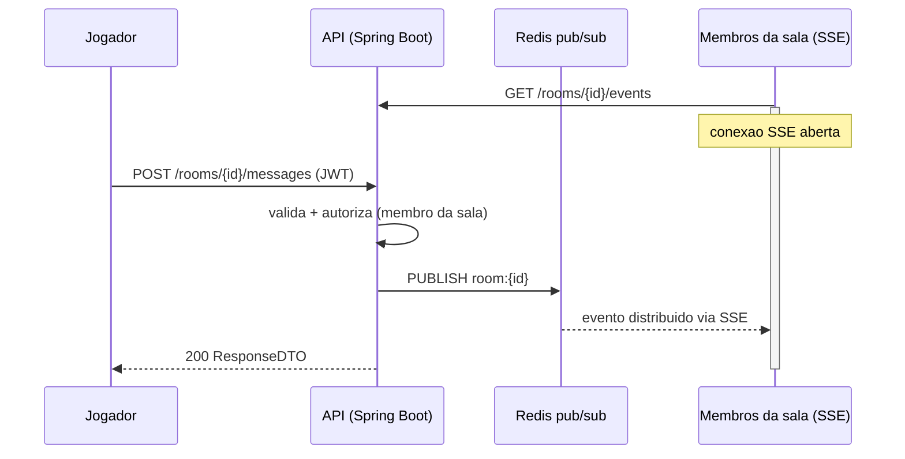

# ADR 005 — Server-Sent Events (SSE) + Redis Pub/Sub para eventos de sala em tempo real

## Status

Aceito (2026-07-19) — ainda nao implementado. Este ADR registra a decisao arquitetural antes da implementacao.

**Reafirmado (2026-08-01):** a decisao foi desafiada considerando turnos e rolagem de dados como possivel caso de WebSocket. Conclusao: turnos e dados sao acoes pontuais que exigem validacao/autorizacao no servidor (dado rolado no servidor, anti-cheat) — o padrao POST + broadcast deste ADR. Jogo por turnos e, por definicao, baixa frequencia. A visao de jogabilidade confirmada (turnos, dados, chat, fichas — sem mapa tatico arrastavel) mantem o SSE; o criterio de migracao para WebSocket na secao abaixo permanece o gatilho.

## Contexto

As salas de RPG precisam de comunicacao em tempo real: chat entre jogadores, rolagem de dados visivel para todos, narracao do Mestre e, futuramente, atualizacoes de fichas de personagem. A escolha do mecanismo de transporte afeta autenticacao, infraestrutura e todo o codigo de jogabilidade que vira depois — por isso a decisao e registrada agora, antes da fase de personagens e mecanicas.

A observacao central que orientou a decisao: a comunicacao de uma sala de RPG e **assimetrica**.

- As **acoes** do jogador (enviar mensagem, rolar dado, atualizar ficha) sao requisicao/resposta classica — `POST` comum, que reaproveita toda a infraestrutura existente: `JwtAuthenticationFilter`, Bean Validation, `ResponseDTO`, `GlobalExceptionHandler` e as autorizacoes de sala (`findRoomAsMaster` e o futuro `findRoomAsMember`).
- O que precisa ser "tempo real" e apenas a **distribuicao**: todos os membros conectados da sala verem o evento que acabou de acontecer. Fluxo unidirecional servidor → cliente.

## Decisao

Usar **Server-Sent Events (SSE)** para a distribuicao de eventos, com **Redis Pub/Sub** como barramento entre a publicacao e as conexoes abertas.

### Arquitetura

1. **Acoes** entram por endpoints `POST` normais (ex.: `POST /rooms/{id}/messages`), autenticados por JWT e autorizados por membership da sala.
2. O service publica o evento no canal Redis `room:{id}` (`PUBLISH`).
3. Cada instancia da API mantem as conexoes SSE dos membros (`GET /rooms/{id}/events`) e repassa os eventos recebidos do canal — o Pub/Sub garante que o fan-out funciona mesmo com multiplas instancias da API.

### Por que nao WebSocket/STOMP

WebSocket oferece bidirecionalidade que este caso de uso nao exige — as acoes ja tem um canal natural (HTTP). Adota-lo agora custaria:

- Um protocolo novo (STOMP) e handshake proprio de autenticacao, fora do fluxo JWT existente;
- Perda das vantagens nativas do SSE: reconexao automatica do `EventSource` com `Last-Event-ID`, atravessar proxies/firewalls como HTTP comum, e debug trivial (e so um `curl`);
- Mais superficie de infraestrutura sem beneficio para chat, dados e narracao.

A stack para SSE ja esta instalada no projeto sem uso: `spring-boot-starter-webflux` (para `Flux`/`SseEmitter`) e `spring-boot-starter-data-redis-reactive` (para o Pub/Sub reativo).

## Trade-offs aceitos

1. **`EventSource` nao envia header `Authorization`.** A API `EventSource` do navegador nao permite headers customizados. Solucao planejada: endpoint autenticado emite um token curto de uso unico, passado como query param na abertura do stream (alternativas: cookie ou `fetch` com streaming no frontend). A decisao final fica para a implementacao.
2. **Limite de 6 conexoes por dominio no HTTP/1.1.** Multiplas abas do navegador podem esgotar o limite. Desaparece com HTTP/2 no proxy/servidor — requisito registrado para o deploy.

## Criterio de migracao futura

Se a jogabilidade evoluir para estado bidirecional de baixa latencia (ex.: mapa tatico com arrastar em tempo real, presenca intensa de "esta digitando"), migrar o canal de saida para WebSocket. A migracao e localizada: os endpoints `POST` de acao permanecem intactos; apenas o transporte de distribuicao muda. Decisao reversivel e decisao barata.

## Consequencias

- Novos endpoints de acao seguem o padrao ja estabelecido do projeto (Controller → Service → `ResponseDTO`), sem excecoes de arquitetura.
- O Redis passa a ter um terceiro papel (sessoes, rate limiting/invites e agora Pub/Sub) — reforca a dependencia, ja aceita nos ADRs anteriores.
- O deploy futuro deve servir HTTP/2 (registrado como requisito de infraestrutura).
- A implementacao do SSE exigira o helper `findRoomAsMember` (autorizacao por membership), ja planejado para as rotas de leitura de sala.